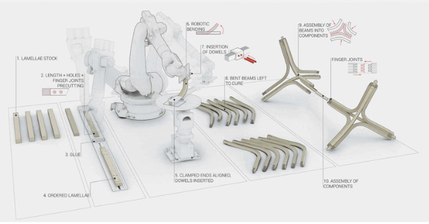

- Daily 📌
	- time-in:: 8:30
	  desired-time-out:: 18:30
	  lunch-activity:: fixing bike
	  actual-time-out::
	- #### What are my goals to reach today?
		- DONE Reading 1-2 papers
		- TODO Compiling list of papers to read over the next 6 weeks
		- TODO Planning experiments and research plan for the summer
		- TODO Computational model for simple winding frame
	- #### What am I reading today?
		- #### DONE Read Status📖
		  title:: Bending-Active Lamination of Robotically Fabricated Timber Elements
		  year:: 2019
		  authors:: Bahar Al Bahar, Abel Groenewolt, Oliver David Kreig, Achim Menges
		  type:: [[Papers]]
		  link:: 
		  :LOGBOOK:
		  CLOCK: [2023-06-29 Thu 14:53:19]--[2023-06-29 Thu 14:53:56] =>  00:00:37
		  CLOCK: [2023-06-29 Thu 14:53:57]--[2023-06-29 Thu 14:54:01] =>  00:00:04
		  CLOCK: [2023-06-29 Thu 14:54:01]--[2023-06-29 Thu 14:54:02] =>  00:00:01
		  CLOCK: [2023-06-29 Thu 14:54:02]--[2023-06-29 Thu 14:54:03] =>  00:00:01
		  CLOCK: [2023-06-29 Thu 14:54:06]--[2023-06-29 Thu 14:54:06] =>  00:00:00
		  CLOCK: [2023-06-29 Thu 14:54:14]--[2023-06-29 Thu 14:54:14] =>  00:00:00
		  CLOCK: [2023-06-29 Thu 14:54:15]--[2023-06-29 Thu 14:54:16] =>  00:00:01
		  CLOCK: [2023-06-29 Thu 14:54:17]--[2023-06-29 Thu 14:54:36] =>  00:00:19
		  CLOCK: [2023-06-29 Thu 14:54:58]--[2023-06-29 Thu 14:54:59] =>  00:00:01
		  CLOCK: [2023-06-29 Thu 14:54:59]--[2023-06-29 Thu 14:55:00] =>  00:00:01
		  CLOCK: [2023-06-29 Thu 14:55:00]--[2023-06-29 Thu 14:55:01] =>  00:00:01
		  CLOCK: [2023-06-29 Thu 14:55:01]
		  :END:
			- content::
				- layering thin timber approach
				- accurately modelling bending
					- #elasticacurvature
					- #bendingmodel
					- #connectiondetails
				- predicating and leveraging the internal pressures between layers to lock in the bend
				- predicating
				- dowel connection between layers
			- {:height 300, :width 400}
		-
		- #### DONE Read Status📖
		  title:: A Multi-Scalar Approach for the Modelling and Fabrication of Free-Form Glue-Laminated Timber Structures
		  year:: 2018
		  authors:: Tom Svilans, Paul Poinet, Martin Tamke, Mette Ramsgaard Thomsen
		  type:: [[Papers]]
		  link:: 
		  :LOGBOOK:
		  CLOCK: [2023-06-29 Thu 14:53:19]--[2023-06-29 Thu 14:53:56] =>  00:00:37
		  CLOCK: [2023-06-29 Thu 14:53:57]--[2023-06-29 Thu 14:54:01] =>  00:00:04
		  CLOCK: [2023-06-29 Thu 14:54:01]--[2023-06-29 Thu 14:54:02] =>  00:00:01
		  CLOCK: [2023-06-29 Thu 14:54:02]--[2023-06-29 Thu 14:54:03] =>  00:00:01
		  CLOCK: [2023-06-29 Thu 14:54:06]--[2023-06-29 Thu 14:54:06] =>  00:00:00
		  CLOCK: [2023-06-29 Thu 14:54:14]--[2023-06-29 Thu 14:54:14] =>  00:00:00
		  CLOCK: [2023-06-29 Thu 14:54:15]--[2023-06-29 Thu 14:54:16] =>  00:00:01
		  CLOCK: [2023-06-29 Thu 14:54:17]--[2023-06-29 Thu 14:54:36] =>  00:00:19
		  CLOCK: [2023-06-29 Thu 14:54:58]--[2023-06-29 Thu 14:54:59] =>  00:00:01
		  CLOCK: [2023-06-29 Thu 14:54:59]--[2023-06-29 Thu 14:55:00] =>  00:00:01
		  CLOCK: [2023-06-29 Thu 14:55:00]--[2023-06-29 Thu 14:55:01] =>  00:00:01
		  CLOCK: [2023-06-29 Thu 14:55:01]
		  :END:
			- content::
				-
			- {:height 300, :width 400}