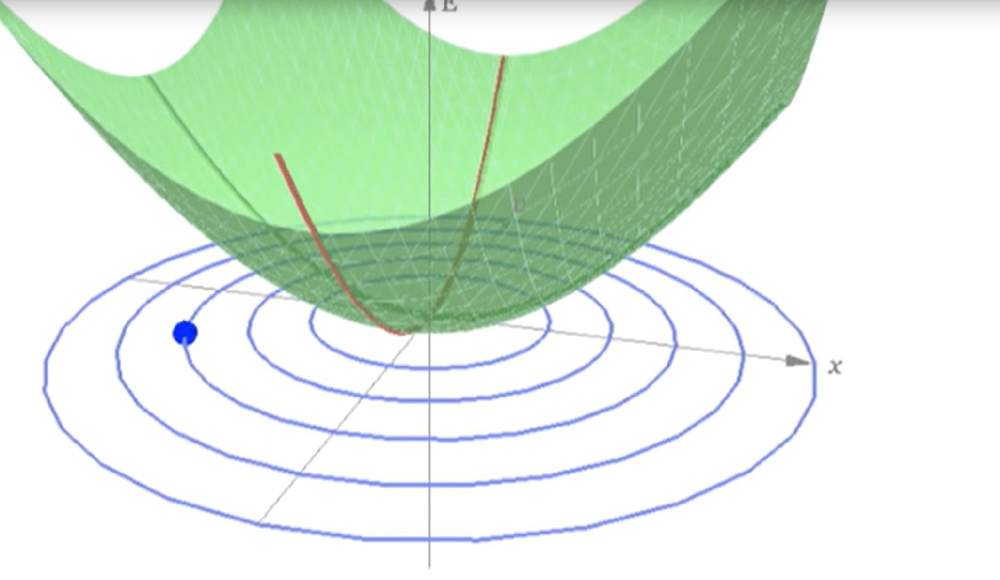

- Daily 📌
	- time-in:: 09:52
	  desired-time-out:: 18:00
	  lunch-activity:: book club + stretching + bike (?)   
	  actual-time-out:: 17:45
	- #### What are my goals to reach today?
		- DONE read Eric's book club passage
		- DONE input Stefana's suggestions into the spreadsheet
		- DONE 6-week summer plan --> papers to read and experiments to conduct
		- TODO Basic experiment with wood layers
		- DONE look at Frank's figma work
		- DONE do the teach + learn logos
		- DONE have HJ meeting at 4PM
		-
	- #### What am I reading today?
		- #### Book Club Reading📖
		  title:: Thought as a Technology
		  year:: 2016
		  authors:: Michael Nielsen
		  type:: [[Book Club]]
		  link:: https://cognitivemedium.com/tat/index.html
			- key-takeaways::
				- Challenging human cognition: rather than just solving problems expressed in terms we already understand, the goal is to change the thoughts we can think
				- For instance, one of the world's best-known art teachers, [Betty Edwards](https://en.wikipedia.org/wiki/Betty_Edwards), explains that the visual thinking of most non-artist adults is limited to what she refers to as a simple “symbol system”, and that this constrains both what they see and what they can visually conceive:
					- Cubist artists such as Picasso developed the technique of using multiple points of view in a single painting. Once you've learnt to see cubist art, it can give you a richer sense of the structure of what's being shown
				- **Heuristics**: process by which humans use mental shortcuts to arrive at decisions (availability, representativeness, and anchoring and adjustment)
				- A common informal model of augmentation is what we may call the *cognitive outsourcing* model: we specify a problem, send it to our device, which solves the problem, perhaps in a way we-the-user don't understand, and sends back a solution
					- In this essay, we've seen a different way of thinking about augmentation.  Rather than just solving problems expressed in terms we already understand, the goal is to change the thoughts we can think
		- {:height 300, :width 400}