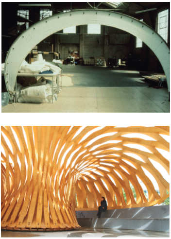
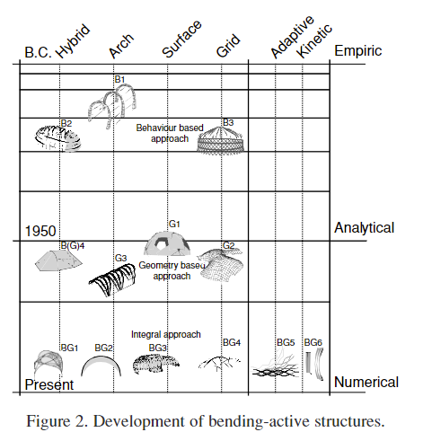

### Active Bending, a Review on Structures where Bending is Used as a Self-Formation Process
background-color:: green
authors:: [[Julian Leinhard]] [[Jan Knippers]]
type:: [[article]]
read-status:: [[read]]
published:: [[2013]] 
link:: 
additional-links::
major-themes::
minor-themes::
	- #### Content:
	-
	- #### Image:
	  {:height 300, :width 400}
	  
	  {:height 300, :width 400}
-