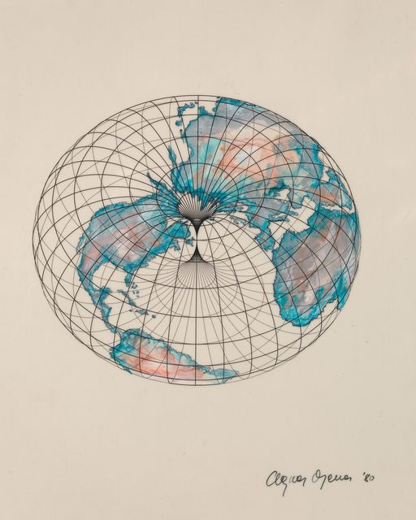
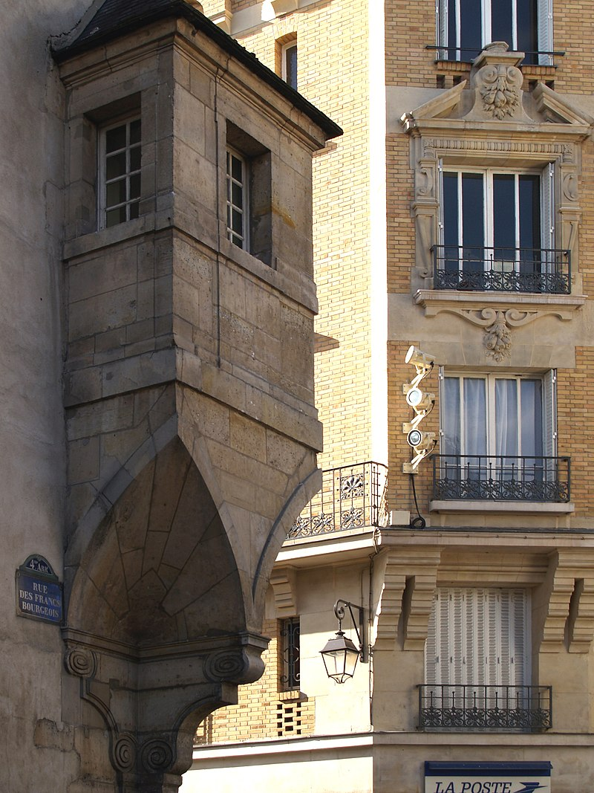
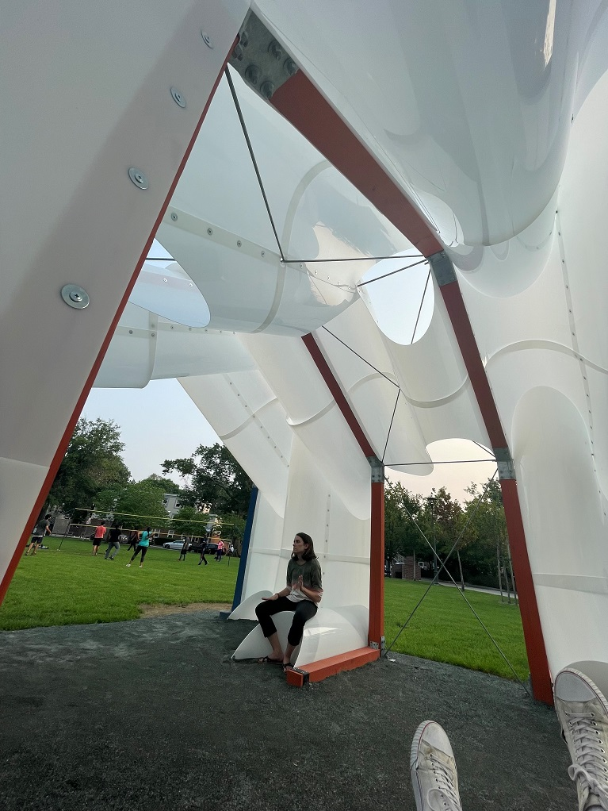

- Daily 📌
	- #### What are my goals to reach today?
		- TODO
		-
	- #### What am I reading today?
	- [[Andrew Witt]] presentation
		- Fondation Louis Vuitton
			- curved glass working with automotive manufacturer
		- Louvre Abu Dhabi
			- solar irradiance as an inverse parametric driver for dome geometry
			- variable microclimates created underneath dome based on shape
		- intersection between geometry and making
			- developed a method to create these minimal spanning surfaces
				- minimized bending and torsion to allow fabrication to allow the shape to be fabricated in strips
				- options for efficiency and cost effectiveness
					- using **less** material
					- using **waste** material
	- [[Iman Fayad]] presentation
		- Ange Denes: "working with a paradox, defining the elusive, visualizing the invisible, communicating the incommunicable…"
			- 
				-
		- deliberate misinterpretation
			- projection
				- translation and interpretation
				- going from **flat** --> drawing board, material flatness --> to **form** --> occupiable 3D architectural space
				- relating to the experience of a space **OR** constructability (ie. developability)
		- felix candela
			- thin shell, doubly rolled
		- **projective**, **descriptive**, **analytic** approach to geometry
			- these techniques can be used not only for form production but analysis as well
			- mapping physical space (euclidian / planar) to visual space (radial) by playing with reality and illusion
			- the relation of the human body in space
			- highly calibrated relationship between drawing, form materiality
			- Hotel d'Angouleme Lamoignon Paris, France
				- the drawings given to the stone masons were an irregularly cut combination of stone to form the arches
				- 
			- how to negotiate and deal with **tectonic seams**
			- she explores:
				- curved crease folding
					- first seen in bauhaus
					- a way to create complex curvature from planar material
					- developed as a structural strategy in surface-active structures (Engel)
						- https://www.google.com/search?client=firefox-b-d&q=Engel+surface+active+structures
				- and another technique ..?
			- CLOUD HOUSE
			  
			- question:
				- analog experimental models
				- bending model accuracy? how does she do it if at all? what about with a more heterogeneous material like bamboo or timber
				- How do the seams between elements limit scalability? Doesn't this hinge on model accuracy?
				- Experimentation with thicker or variable thickness material? Going beyond thin surface-active towards structural or insulative elements
			-
			-