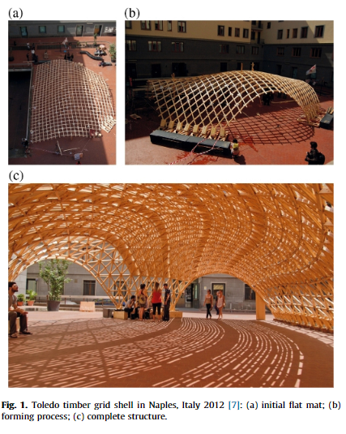

- time-in::
	- #### Notes From Today:
		- good resource for #bent-timber-projects
		  https://parametrichouse.com/actively-bent-timber/
- ### Actively Bent Timber: Form Finding and Structural Analysis of Actively Bent Timber Grid Shells
  background-color:: green
  authors:: [[B. D'Amico]] [[A. Kermani]] [[H. Zhang]]
  type:: [[article]]
  read-status:: [[read]]
  published:: [[2014]] 
  link:: 
  additional-links::
  major-themes::
  minor-themes::
	- #### Content:
	-
	- #### Image:
	  {:height 300, :width 400}