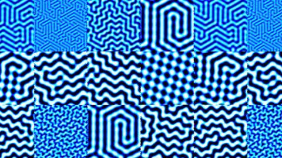
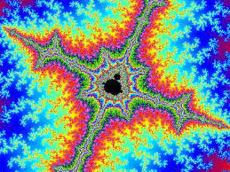

- Daily 📌
	- #### What are my goals to reach today?
		- TODO read bending active paper
		- TODO read bending active thesis
		- TODO create reading list for summer
		- TODO order sensors I want to begin working with
	- #### What are the notes from today?
	- The Secret Life of Chaos
		- deep underlying natural principles:
			- Turing --> patterns
			  
			- Belousov-Zhabotinsky --> reaction
			  
			- Mandelbrot --> fractals
			  
		- **Chaos**: even a system that can be entirely described by mathematical equations, with nothing random or unpredictable about them, can have outcomes that are completely unpredictable
		- **Benoit Mandelbrot**
			- An intellectual jack-of-all-trades. While he will always be known 
			  for his discovery of fractal geometry, Mandelbrot should also be 
			  recognized for bridging the gap between art and mathematics, and showing that these two worlds are not mutually exclusive.
			- Mandelbrot Set
				- like a video loop, each output becomes the input loop for the next set
				- simple mathematically equation can produce a picture of infinite complexity
				- fractal property of being similar at all scales mirrors a fundamental ordering principle found in nature
-