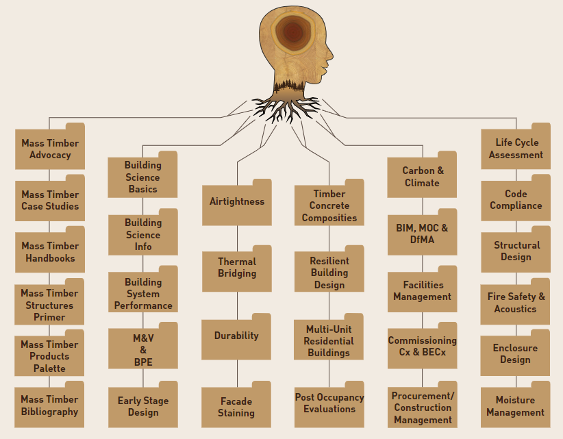

#### TODO Read Status📖
title:: Mass Timber Building Science Primer
year:: 2021
authors:: Mass Timber Institute
type:: [[Papers]]
link:: 
:LOGBOOK:
CLOCK: [2023-06-29 Thu 14:53:19]--[2023-06-29 Thu 14:53:56] =>  00:00:37
CLOCK: [2023-06-29 Thu 14:53:57]--[2023-06-29 Thu 14:54:01] =>  00:00:04
CLOCK: [2023-06-29 Thu 14:54:01]--[2023-06-29 Thu 14:54:02] =>  00:00:01
CLOCK: [2023-06-29 Thu 14:54:02]--[2023-06-29 Thu 14:54:03] =>  00:00:01
CLOCK: [2023-06-29 Thu 14:54:06]--[2023-06-29 Thu 14:54:06] =>  00:00:00
CLOCK: [2023-06-29 Thu 14:54:14]--[2023-06-29 Thu 14:54:14] =>  00:00:00
CLOCK: [2023-06-29 Thu 14:54:15]--[2023-06-29 Thu 14:54:16] =>  00:00:01
CLOCK: [2023-06-29 Thu 14:54:17]--[2023-06-29 Thu 14:54:36] =>  00:00:19
CLOCK: [2023-06-29 Thu 14:54:58]--[2023-06-29 Thu 14:54:59] =>  00:00:01
CLOCK: [2023-06-29 Thu 14:54:59]--[2023-06-29 Thu 14:55:00] =>  00:00:01
CLOCK: [2023-06-29 Thu 14:55:00]--[2023-06-29 Thu 14:55:01] =>  00:00:01
CLOCK: [2023-06-29 Thu 14:55:01]
:END:
	- content::
		- Introduction
			- provides overview on why the primer is necessary, and the challenges facing mass timber industry in Canada
		- Mass timber and the need for building science
			- properties of wood and mass timber products
		- Mass timber construction technology
			- outlines the 8 primary mass timber engineered wood products and connectors that are available to put them all together
		- Mass timber industry stakeholders
		- Considerations for mass timber buildings
			- key parameters such as synergies, planning, integrated design process, etc.
	-  {:height 300, :width 400}
	-