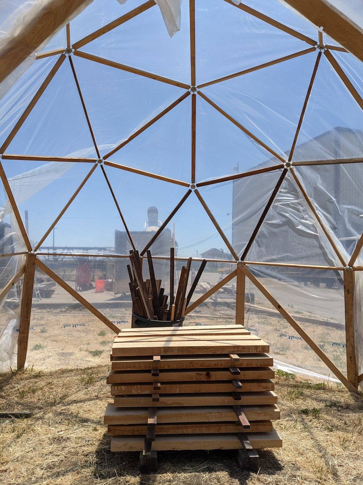

time-in:: 9:30

	- #### Notes From Today:
		- Dr. Paul Mayencourt --> https://paulmayencourt.com/bio
			- low-carbon design solutions for the built environment
			- structural design, forestry, and materials
			- #undervaluedtimber #smalldiametertimbers and underutilized Californian hardwoods species for #highperformance architectural and engineering practices
			- Project: High-Performance, Low Cost Solar Kilns
				- {:height 300, :width 400}
		-