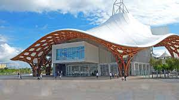

- PAPERS HERE: 
- AAG - Day 1
	- Sigrid Adriaenssens
		- timber as formwork for concrete shells
		- 
		- Chapel of Palmira - 1959 - Candela
		- 
		- Experimental timber HP shell - 1963 - Stuttgart
		- we **still** use timber as formwork for concrete
		- wood has an ability to shrink and swell - resulting from the arrangement of cellulose fibres -- Dylan Wood example of leveraging this to provide form + structure
- Paper Session I:
	- Lawson Spencer – Unlog Tower
		- {:height 538, :width 796}
		- his paper found here: 
	- Dylan Wood: HYGROSHELL – In Situ Self-Shaping of Curved Timber Shells
- Paper Session II:
	- Moritz Niebler – Bent-on-Site Flat-Pack Delivery of a Timber Shell --> [design2production](https://www.designtoproduction.com/en/)
	- Romain Mesnil - Design and Fabrication of a Pseudo - Geodesic Gridshell
		- 
	- Eike Schling - Asymptotic Geodesic Hybrid Timber Gridshell
		- 
		- Centre Pompidou -- Metz
		- beautiful mechanism for shaping the grid shell -- when you push the two groups of lamellas naturally follow this negative curvature
		- asymptotic curves are the stiffest (is it true??) -- more a bending structure than a shell structure, the bracing is very important with these structures and carrying all of the membrane loads
	- Paper Session V:
		- Seiichi Suzuki: BamX: Rethinking Deployability in Architecture Through Weaving
			-
-
- Random Notes:
	- Iman Fayad -- https://projectif.org/work/fibrous-tectonics
	- Bruno Knychalla -- https://www.additive-tectonics.com/contact/
	- Janet Echelmann -- fiber artist and sculptor -- https://www.echelman.com/
	- Molly Wright Steenson