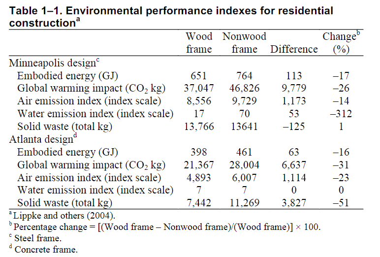
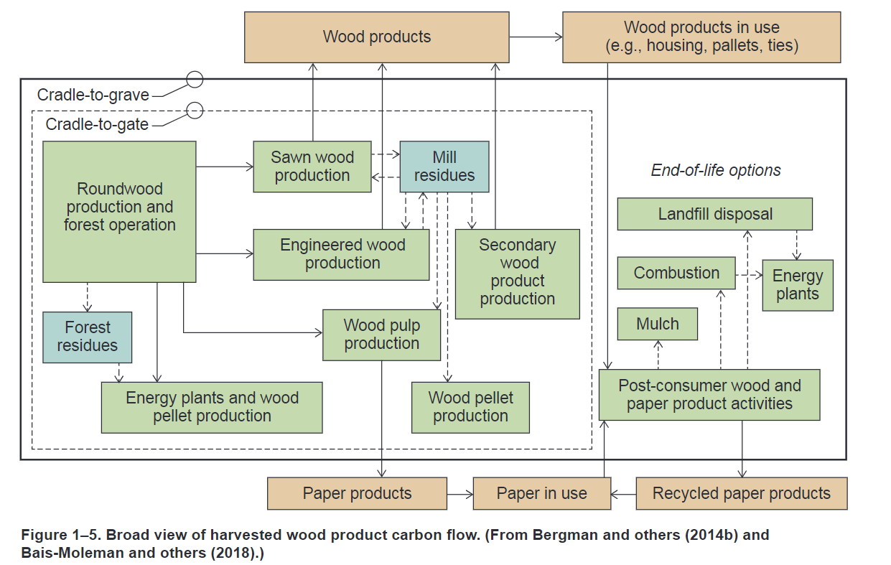

- #TODO
	- prepare tutorial for Thursday with Jingwen
	- French homework -- do Tuesday morning!
	- read up on Wood Science!!
	- read up on Timber Engineering
	- Nico's CV
-
- ### Book Title
  background-color:: green
  authors:: [[USDA]]
  type:: [[book]]
  read-status:: [[read]]
  published:: [[2021]] 
  link::  
  additional-links::
  major-themes:: #forestrymanagement #lifecycleanalysis #biologicalstructureofwood #mechanicalpropertiesofwood
  minor-themes:: #typesoflumber #connections #structuralanalysis #woodadhesives #firesafety #woodfinishings #builtexamples #treatingwood
	- #### Content:
		- CHAP 1: Wood As A Renewable Resource
			- Maintaining healthy and resilient forests involves having product and market options for all materials
			- Timber sales and other removals of forest products support agency strategic objectives to foster resilient, adaptive ecosystems to mitigate wildfire risk and climate change, produce carbon-storing sustainable materials, and strengthen communities
			- Forest and woodlands make up over one-third of the U.S. landscape and contain 1 trillion cubic feet (28.3 billion m3) of wood volume
			- Tree cutting and removal occurs on less than 2% of forest land per year
			- Wildfire, insects, and disease are among the biggest threats to forests and woodlands in the nation. Low harvest rates, aging forests, mortality from insect and disease infestations, and extreme weather events have combined to create conditions that facilitate wildfire
			- **Timberland** is forest land that is producing or is capable of producing crops of industrial wood and not withdrawn from timber utilization by statute or administrative regulation (Oswalt and others 2019)
				- It makes up 67% of the forest land, 87% of which is considered to be of natural origin
				- The remaining 13% would be considered planted forest, which may include plantations, augmented planting of natural stands, or planting for the purposes of restoration, such as after a fire (Oswalt and others 2019)
			- LCA of timber frame vs non-timber frame houses in the US:
				- {:height 400, :width 500}
			- Harvested wood products carbon flow:
				- {:height 400, :width 500}
			-
			-
		- CHAP 2: Characteristics and Availability of Commercially Important Woods
			-
	- #### Image:
	  [PASTE IMAGE HERE]{:height 300, :width 400}
	-
	-