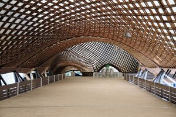
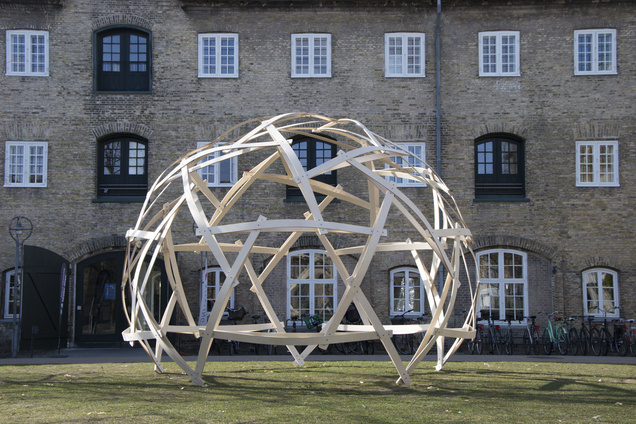
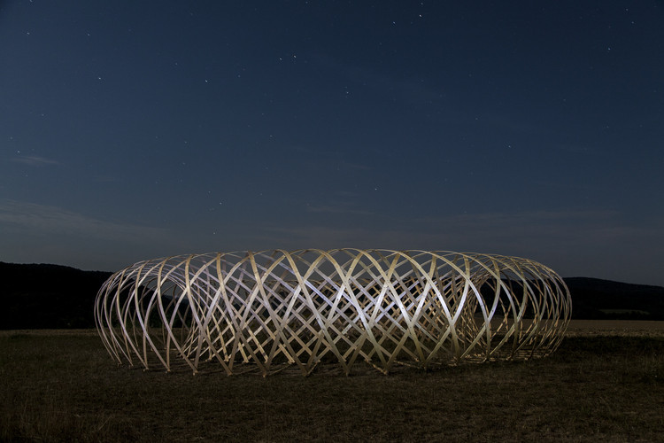

### Advances in Architectural Geometry
background-color:: green
authors:: [[Kathrin Dörfler, Jan Knippers, Achim Menges, Stefana Parascho, Helmut Pottmann, Thomas Wortmann]]
type:: [[book]]
read-status:: [[read]]
published:: [[]] 
link:: 
additional-links::
major-themes::
minor-themes::
	- #### Content:
		- Notable Papers:
			- **The Finite Element Method (FEM) of the Unlog Tower** - *Lawson Spencer, Matthew T. Reiter, Leslie Lok, Sasa Zivkovic*
				- investigates how far this discarded material can be stretch through robotic kerfing and elastic kinematics
					- through creating bending-active leaf-spring timber components that can easily be deployed and disassembled
				- uses EAB-infested white ash, to simulate and assemble roundwood timbers into bending-active structural components for a fully permitted outdoor installation
				- utilizes what they call the **Unlog Method** -- separate paper on this
				- timber gridshells
					- Multihalle Mannheim (1974)
						- {:height 200, :width 200}
					- ReciPlyDome
						- {:height 200, :width 200}
					- Torus Research Pavilion by CODA
						- {:height 200, :width 200}
	- #### Image:
	  [PASTE IMAGE HERE]{:height 300, :width 400}
-