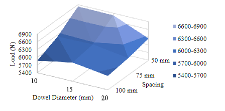
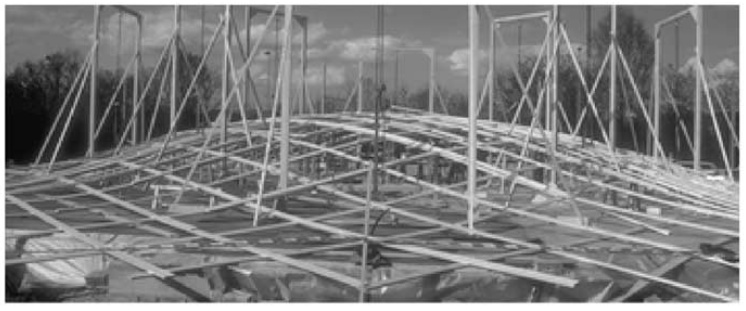
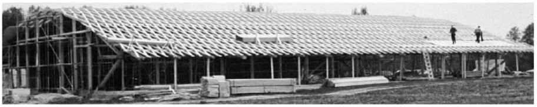
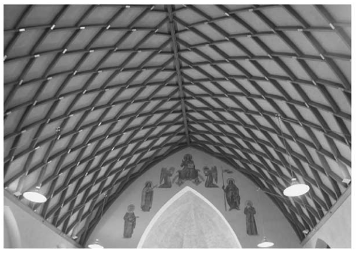

### Dowel Laminated Timber Elements Manufactured using Compressed Wood Dowels
background-color:: green
authors:: [[O'Ceallaigh, McGetrick, Harte]]
type:: [[article]]
read-status:: [[read]]
published:: [[2022]] 
link::  
additional-links::
major-themes:: #dowelconnection #noadhesives #structuralanalysis #structuralbehaviour 
minor-themes:: #doweldiameter #dowelspacing #loadcapacity
	- #### Content:
		- dowel diameter and spacing have significant influence on the max load capacity and stiffness of the DLT
		- predicted failure behaviour includes dowel bending, dowel-timber embedment, and tensile fracture of the bottom tensile laminate
		- their model allows an **optimised** dowel arrangement to be manufactured
	- #### Image:
	  {:height 300, :width 400}
- ### Modeling of layered timber beams and ribbed shell frameworks
  background-color:: green
  authors:: [[Gliniorz, Mosalam, Natterer]] 
  type:: [[article]]
  read-status:: [[read 
  published:: [[2002]] 
  link::  
  additional-links::
  major-themes:: #multilayeredtimberstructures #structuralbehaviour #computationalmodeling #timberribbedshell 
  minor-themes:: #numericalcomputation #deformationandstresses #curvedstructuralcomponents
	- #### Content:
		- methodology for numeric computation of the deformation and stresses in timber multi-layer structures
		- developed for layered beams and extended to curved members for use in analysis and design of timber ribbed shells
		- appendix -- describes plane and curved structural components and systems consisting of several timber layers
		- Zollinger timber shells - amoung the first at the beginning of the 20th century
		- fabrication of timber ribbed shells
			- **Method 1**
				- pre-fabricated forms are laid flat on the construction site
				- all timber planks are piled flat and joined loosely by a dowel at the cross-point of the ribs
				- form shape is maintained using temporary supports
				- whole structure is lifted in the finished position using a **fixed pillar crane**
				- once in its final positions, all layers of the tibs are joined by screws or nails and the dowels are tightened
				  
			- **Method 2**
				- falsework (aks soffit scaffolding) taking the form of the shell is constructed
				- different positions of the ribs are labeled on the falsework, where planks are first laid and fixed temporarily
				- filler blocks are fixed on the first plank layer at the cross-points by dowels
				- before falsework is removed, the covering boards are joined by nails or dowels on the ribs
				- 
	- #### Image:
	  {:height 300, :width 400}
-
- ### Review of state of the art of dowel laminated timber members and densified wood materials as sustainable engineered wood products for construction and building applications
  background-color:: green
  authors:: [[]]
  type:: [[article]]
  read-status:: [[read]]
  published:: [[2020]] 
  link::  
  additional-links::
  major-themes::
  minor-themes::
	- #### Content:
	-
	- #### Image:
	  [PASTE IMAGE HERE]{:height 300, :width 400}
-
- ### From the herringbone dome by Sangallo to theSerlio floor of Emy (and beyond)
  background-color:: green
  authors:: [[Roberti, Ruscica, Paris]]
  type:: [[article]]
  read-status:: [[read]]
  published:: [[2021]] 
  link::  
  additional-links::
  major-themes::
  minor-themes::
	- #### Content:
	-
	- #### Image:
	  [PASTE IMAGE HERE]{:height 300, :width 400}
-
-