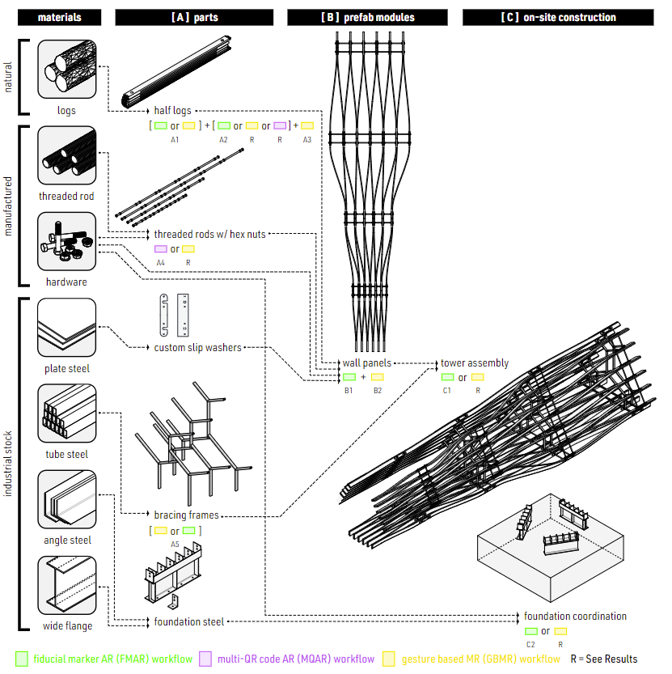

### Extended Reality (XR) Workflows for Multi-Material Assemblies
background-color:: green
authors:: [[Lawson Spencer, Alexander Htet Kyaw]]
type:: [[article]]
read-status:: [[read]]
published:: [[2023]] 
link::  
additional-links::
major-themes::
minor-themes::
	- #### Content:
	-
	- #### Image:
	  
	- {:height 300, :width 400}