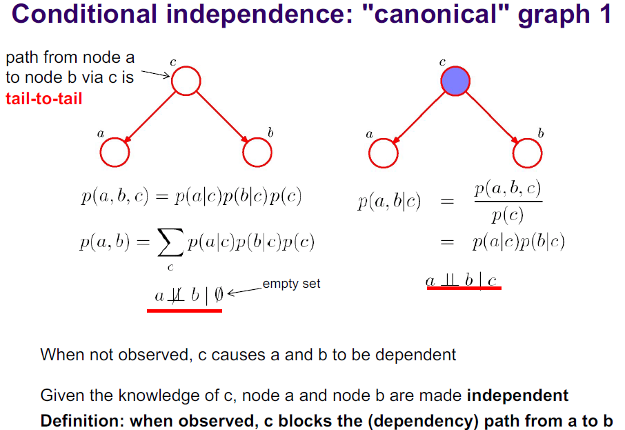

- #studynotes Machine Learning for Engineers
- **Lecture 1 - Introduction to Machine Learning**
	- *What is machine learning?*
		- Ex. mathematical model that gives the probability that a photo represents a face, where 0 is not a face and 1 is a face
		- aims at designing algorithms to infer the world regularities from a finite set of examples
		- in practice, given a set of training examples *D*, build automatically a predictor *f** of a hidden value given the visible signal
		- performance should be good on test data which are not available to chose the predictor
		- {:height 500, :width 500}
	- TOPICS
		- Generative models
		  logseq.order-list-type:: number
			- directed / non-directed models
			  logseq.order-list-type:: number
			- conditional independence
			  logseq.order-list-type:: number
			- maximum likelihood and maximum a posteriori
			  logseq.order-list-type:: number
			- k-Mean + Gaussian Mixture Models (GMM) + E-M algorithm
			  logseq.order-list-type:: number
			- hidden markov models (HMM)
			  logseq.order-list-type:: number
		- Dimensionality reduction
		  logseq.order-list-type:: number
			- PCA, probabilistic PCA, T-SNE
			  logseq.order-list-type:: number
		- Regression techniques
		  logseq.order-list-type:: number
			- least-square + weighted least square
			  logseq.order-list-type:: number
			- iteratively reweighted least squares (IRLS)
			  logseq.order-list-type:: number
			- tensor factorization methods
			  logseq.order-list-type:: number
			- Gaussian mixture regression (GMR)
			  logseq.order-list-type:: number
			- Gaussian process regression (GPR)
			  logseq.order-list-type:: number
		- Classification methods
		  logseq.order-list-type:: number
			- KNN and Naive Bayes
			  logseq.order-list-type:: number
			- decision trees and ensemble methods (random forest)
			  logseq.order-list-type:: number
			- kernel methods and SVM
			  logseq.order-list-type:: number
		- Deep learning
		  logseq.order-list-type:: number
			- multilayer perceptron
			  logseq.order-list-type:: number
			- convolution neural network (CNN)
			  logseq.order-list-type:: number
			- learning methods and CNN models
			  logseq.order-list-type:: number
	- Probability
		- {:height 500, :width 500}
	- Gradient descent
		- gradient should be 0, therefore you find the minimum of this function
		- 
	- **Three types of learning/ predictions**
		- Classification
		  logseq.order-list-type:: number
			- ie. object recognition, cancer detection, speech processing
			  logseq.order-list-type:: number
		- Regression
		  logseq.order-list-type:: number
			- ie. customer satisfaction, stock prediction, epidemiology
			  logseq.order-list-type:: number
		- Density estimation
		  logseq.order-list-type:: number
			- ie. data visualisation, pre-processing, outlier detection
			  logseq.order-list-type:: number
	- Learning consists of finding a "good" functional in a pre-defined set of functionals *F*
	- We define "good" functionals through a loss function
	- Machine learning algorithms combine:
		- a space *F*
		- a regularization term *H(f)*
		- an algorithm to compute *argmin*
		- **the art of machine learning is to combine expertise to build a sound space of predictors, and good statistical techniques to pick the best one**
		- PROCESS:
			- Write Code --> Train --> Validate --> Test --> Paper
	- Under/Overfitting
		- underfitting: no available functional is consistent with the data we have
		- overfitting: the chosen functional is extremely good on the training data, but models irrelevant random perturbations (not good on test data)
			- a sign of overfitting is when the model is extremely accurate on training and doesn't work on testing data
		- to reduce the risk of overfitting:
			- increasing the amount of data
			- impoverish the space *F* (less functionals, early stopping)
			- regularization - penalizing the large coefficients (because it makes the choice of f* less dependent on data)
			- k-classifier AKA nearest neighbour classifier, where you predict that the class of an X is the class of the closest training example
		- Bias / Variance tradeoff
			- {:height 500, :width 500}
			  id:: 659fd161-5dc9-4325-a6be-33590e246aec
	- Discriminative vs. Generative
		- discriminitize methods -- produce value of interest without modeling the data structure
		- generative methods -- relies on a model of the data, even if it is not the quantity of interest
	- Supervised vs. Unsupervised
		- supervised -- has access to the values to predict
		- unsupervised -- no access to the values to predict, they are often used in density estimation
		- semi-supervised -- the value to predict is available for some datapoints but not others
	- Parametric vs. Non-parametric
		- parametric -- fit a finite (small) number of parameters
		- non-parametric -- select a model with a large (possibly infinite) number of degrees of freedom
- **Lecture 2 - Introduction to Graphical Models**
	- goals of graphical models
		- represent random variables and their relations
		- given a simple probabilistic problem formulation, describe it in terms of variables and dependencies
		- infer the probability of some variables given the value of others
	- probabilistic graphical models
		- graphical representations of probability distributions
		- visualisation of the structure of probability distributions
			- aim to be intuitive
			- compact representation of distributions and variables
	- Bayesian Networks (BNs)
		- NODES
			- subsets of random variables (RVs)
			- discrete or continuous
		- VERTICES
			- relations between RVs
			- directed (Bayes net) or undirected (Markov Random Fields)
		- RESULTING GRAPHS
			- acyclic (no loops) or cyclic
		- types of variables
			- hidden (latent)
				- included to define richer models
				- often have a clear physical interpretation
			- visible (observed)
				- ie. physical measurements
	- BN can express a causal relationship such as cancer --> blood test
	- EXAMPLE
		- a multivariate Gaussian can be expressed as a directed graph that corresponds to
		  a linear-Gaussian model over the components
	- Conditional independence
		- {:height 200, :width 200}
		- {:height 500, :width 500}
		- {:height 500, :width 500}
		- {:height 500, :width 500}
		- {:height 500, :width 500}
		-
- **Lecture 3 -  Learning in Graphical Models - Gaussian Mixture Models**
	-
- Lecture 4 -
-
-
- Lecture 5 -
-