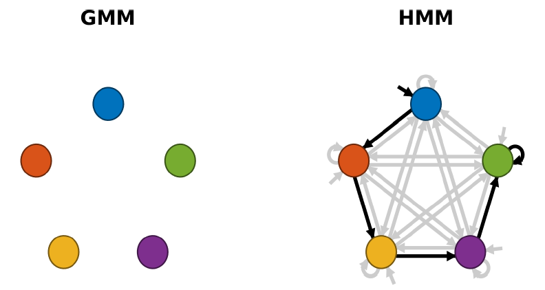
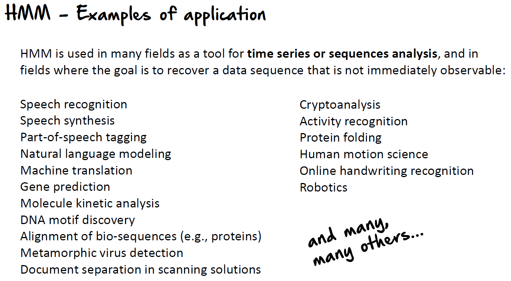
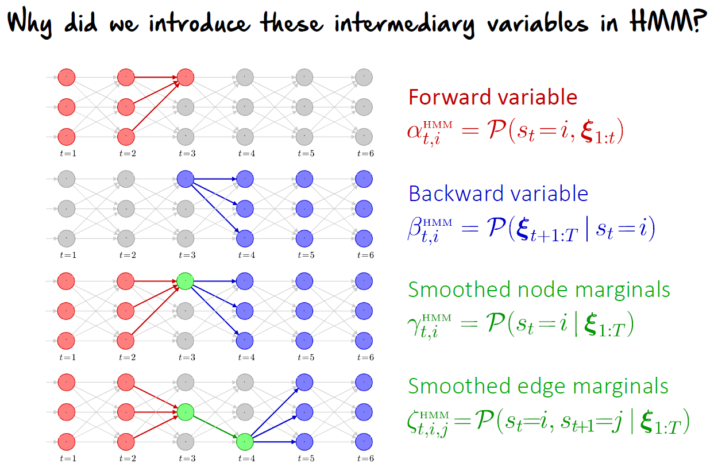
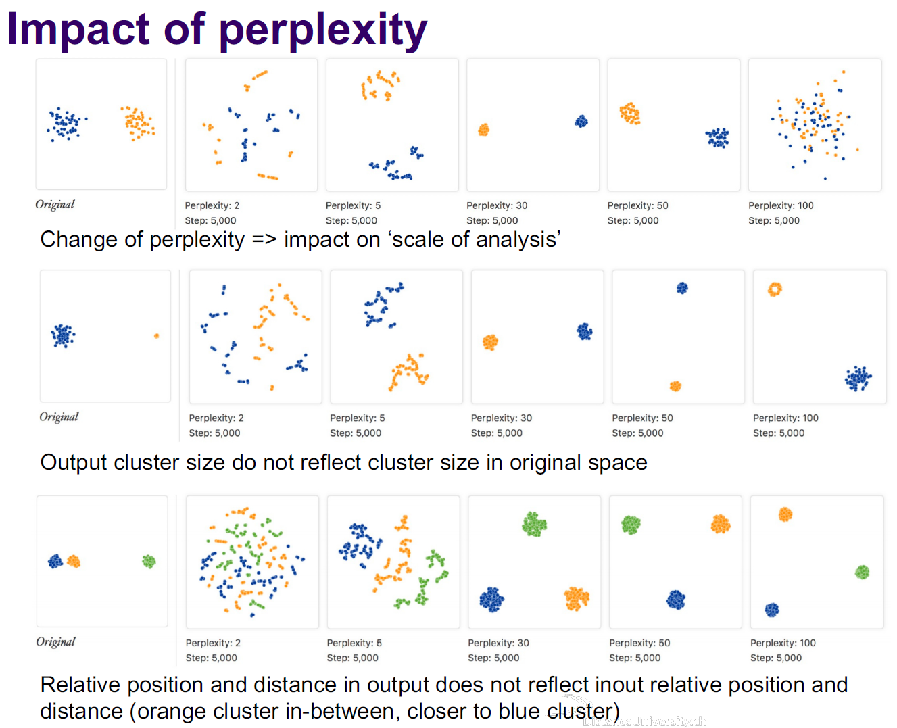
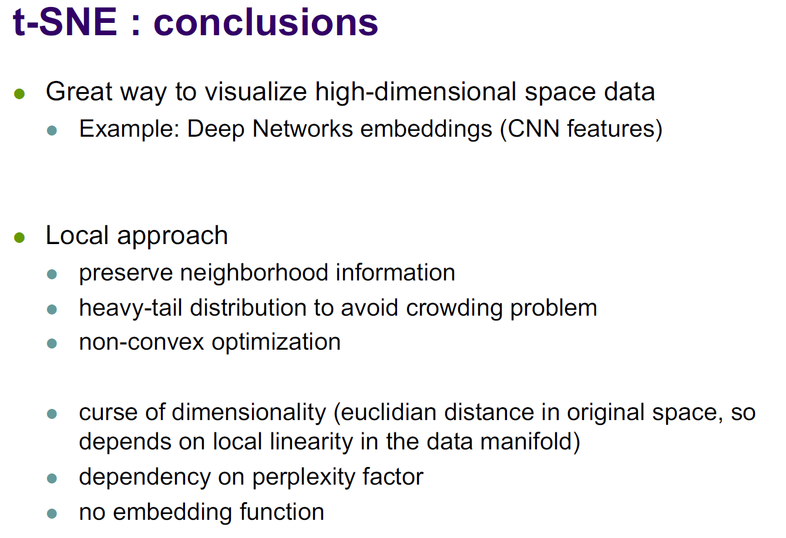
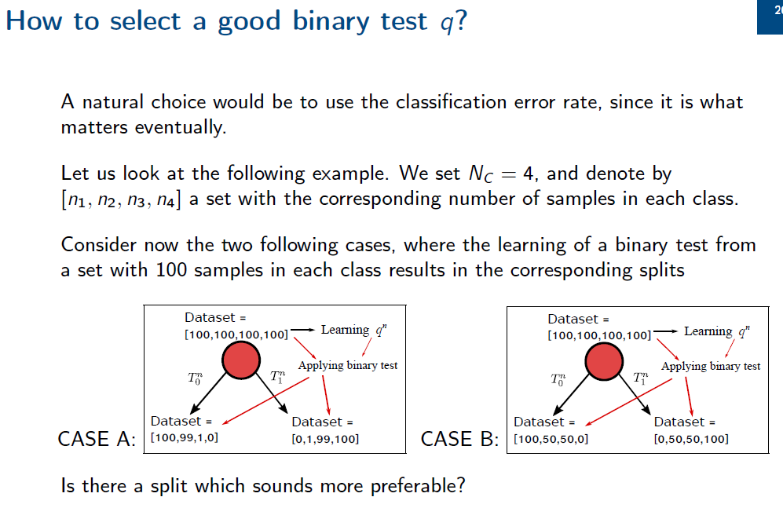
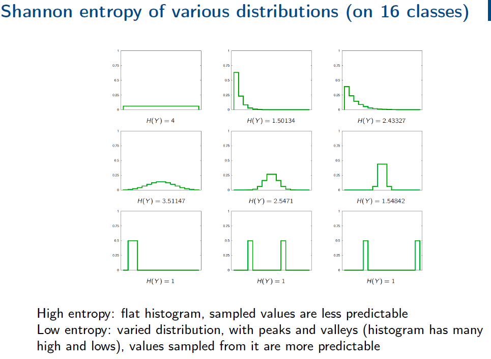
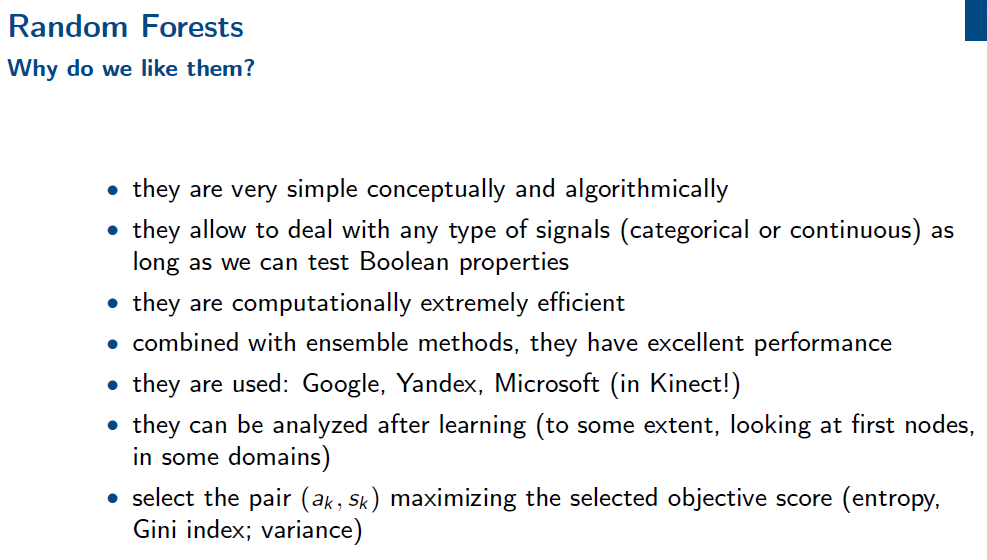
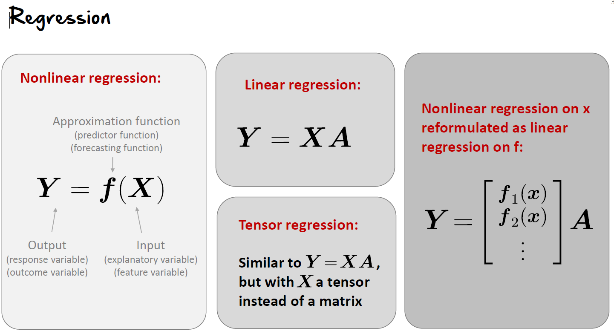

- #studynotes Machine Learning for Engineers
- **Lecture 4 - Hidden Markov Models**
	- these models add transition information between the Gaussians
	- {:height 300, :width 300}
	- transition matrix describes the probability of getting from *state i* to *state j* in one step
	- applications of HMM -- used in many fields as a tool for time series or sequence analysis, and to recover a data sequence that is not immediately observable
		- sentence completion (ie. on mobile devices)
		- data compression
		- text classification
		- automatic writing
		- speech recognition
		- {:height 400, :width 400}
	- Intermediary variables in HMM
		- {:height 400, :width 400}
	- Viterbi decoding
		- MAP = maximum a posteriori
		- MPE = most probable explanation
		- if you're interested in knowing the most probable sequence of states
	- HMM with dynamic features
		- good for generating new data
- **Lecture 5 - Dimensionality Reduction**
	- why do we want dimensionality reduction?
		- data compression
		- usually for visualisation
			- ie. representing a face or a hand (or an element in a photo) accurately with LESS data --> faster comparison, less storage, allow interpretability (ie. what is the structure in the high dimensional space), etc.
	- PCA -- principal component analysis
		- manifold reduction technique
		- try to learn explicit or implicit mapping from the data
		- goals:
			- project data from space of dimension D into lower dimension space M *(M<D)*
		- principles:
			- variance maximization
			- reconstruction error minimization
		- Variance Maximization
		- Reconstruction Error Minimization
		- data whitening -- making the data more gaussian -- normalizing the data
		- **SUMMARY ABOUT PCA:**
			- interest
				- curse of dimensionality: high-dimensionality data difficult to manipulate
				- intrinsic data dimension is usually small
			- PCA
				- feature reduction technique, unsupervised (no data label)
				- project initial data points with a linear projection
				- projection directions given by eigenvectors of covariance matrix
				- projected point keep maximum variance of initial training points
			- application
				- data compression: less coordinates needed, therefore more efficient storage
				- visualization: project high-dim point into 2D or 3D
				- synthesis of new data point feasible
				- noise removal: keep only the essential information --> positive effect on subsequent steps
			- PCA is a way to remove correlation between points and reduce dimensions through linear projection
	- Probabilistic PCA
		- constrained form of Gaussian distribution on *p(x)*
		- classical probabilistic method for finding low-dimensional representation of the data
		- advantage is that we first  present the model and then show its added properties
		- generative process: from latent (low dimensional space) to data space
		- **if all probabilistic distribution of graphical models are gaussian, than any involved distribution is gaussian as well!**
		- Advantages of Probabilistic PCA vs. PCA
			- handles missing components in the data
			- number of free parameters is restricted (compared to full covariance model)
			- still captures dominant data correlation (compared to diagonal covariance model)
			- generative process (we can sample random vectors)
			- likelihood function of data points
				- more information than the PCA reconstruction error
				- allow comparison with other probability density models
			- latent space model -- derivation of computationally efficient EM algorithm for PCA, that does not require computation of covariance matrix
			- probabilistic model + EM -- handling of missing values in the dataset (allows PCA projections even if there are missing values in the input values)
			- principled extensions to other models and particularly mixtures of probabilistic PCA models
		- Factor Analysis (FA)
			- covariance is still taken diagonal, to that the components of x are all independent conditioned on z
			- no closed-form solution for the estimation of parameters
	- t-Stochastique-Neighbour-Embedding (t-SNE)
		- another dimensionality reduction algorithm
		- preserve local structure
		- low dimensional neighbourhood should be the same as original neighbourhood
		- one example of local embedding methods
		- used mainly for data visualisation
		- SNE (without the t) issues
			- crowding problem
				- high dimension space - more room, easy to have multiple neighbours
				- low dimensional space - area available to accommodate moderately distant point not large enough compared to area for nearby data points
				- distinct cluster in high dimensional space pushed closer in lower space -- might not be distinguishable
		- t-SNE
			- symmetrized distribution
				- less sensitive to outliers
				- leads to simpler gradient
			- use of a heavy-tail distribution
				- goes slower to 0 than Gaussian
				- slower change --> more space to move points around in medium distance
			- important parameters -- different perplexity captures different scales in data
				- {:height 500, :width 500}
			- {:height 500, :width 500}
- **Lecture 6 - Decision Trees**
	- aka. random forests
	- can be related to the game of twenty questions -- where one tries to guess an object or person by asking less than 20 questions
	- for **prediction** --> can be seen as a simple form of adaptive testing: the next property to check depends on which you have already tested and the answers you got
	- for **training** --> like the game of 20 questions, one tries to pick the most efficient questions to be able to predict the unknown state as quickly as possible
	- old approach, yet work really well for both small and large amounts of data
	- can be applied to:
		- classification
		- regression
		- density estimation
	- three main aspects:
		- formal definition of a decision tree
		- how to select the binary test at each node
		- how to grow the tree, includes how to stop growing the tree
	- {:height 500, :width 500}
	- most ideal split:
		- CASE A
			- at any given node, the best prediction is the one that minimizes the error rate when making a constant prediction
			- number of errors before the split in CASE A and B = 300 errors for 400 samples == error rate of 0.75
			- number of errors after the split in CASE A --> left node = 100 errors, right node = 100 errors, error rate == 200/400 = 0.5
			- number of errors after the split in CASE B --> left node = 100 errors, right node = 100 errors, error rate == 200/400 = 0.5
			- even though error rates are the same, we prefer **case a** over b because there is a better split with a lot of separation (either the sample go left or right, whereas in Case B they go in both direction)
	- **entropy is a measure of uncertainty** -- a gain in Shannon's entropy is a good estimate of the efficiency of a "question" (binary test)
	- Shannon entropy
		- {:height 500, :width 500}
		- selecting the solution with the smallest conditional entropy leads to better results!
	- Gini's impurity
		- measures the probability that an element taken randomly would be misclassified if its label would be selected according to the distribution of labels in the set *D*
		- the minimum (0) is achieved when all samples belong to a single category
	- Random Forests
		- {:height 500, :width 500}
	- Applications
		- computational biology and bioinformatics
		- images, image classification
		- point of interest recognition -- specific points on an image
		- handwritten digit recognition (MNIST database is a free database of tens of thousands of handwritten characters)
- **Lecture 7 - Linear Regression**
	- {:height 500, :width 500}
	- **Linear Regression:**
		- a statistical method used to model the relationship between a dependent variable and one or more independent variables
		- the aim is to find a linear equation that best predicts the dependent variable based on the values of the independent variables
		- it is useful in situations where you want to understand how changes in one or more predictors are associated with changes in the response variable
		- Model Structure:
			- the relationship between the independet variables and the dependent variable is modeled as a linear combination of the independent vairable
			- mathematically, it is expressed as Y = a + bx + E
				- where y = the dependent variable
				- where x = the indepedent variable
				- where a = the y-intercept
				- where E = the error term
		- Assumptions:
			- assumes a linear relationship between the variables, constant variance of error (homoscedasticity) and errors are normally distributed
		- Use Cases:
			- best for scenarios where the relationship between variables is approximately linear, such as predicting house prices based on size and location
	- Least Squares Method:
		- an approach used in linear regression to estimate the coefficients (B0 and B1) of the regression equation
		- the goal is to minimize the sum of the squares of the differences (residuals) between observed values and the values predicted by the linear model
		- #### Process:
			- **Calculate Predicted Values**: For each observed value of the independent variable XX, calculate the predicted value of YY using a trial regression equation.
			- **Compute Residuals**: For each observation, calculate the residual, which is the difference between the observed value of YY and the predicted value of YY.
			- **Sum of Squares of Residuals**: Calculate the sum of the squares of these residuals. This quantity is known as the Residual Sum of Squares (RSS).
			- **Minimize RSS**: Adjust the coefficients (β0β0​ and β1β1​) to minimize the RSS. This is typically done using calculus, specifically by taking the partial derivatives of the RSS with respect to each coefficient, setting them to zero, and solving for the coefficients.
			-
- **Lecture 8 - Nonlinear Regression**
	- **Nonlinear Regression:**
		- Model Structure:
			- models the relationship between the dependent and independent variables as a nonlinear function
			- can be a polynomial, exponential, logarithmic, or any other nonlinear form
			- the general mathematical form is Y = f(x, B) + E
				- where f(x, B) = a nonlinear function of x and B
				- where E = the error term
		- Assumptions:
			- does not assume a linear relationship, but the form of the nonlinear function must be specified or chosen based on the data
		- Use Cases
			- more complex scenarios where the relationship between variables is not linear, such as biological data or growth rates
	- **KEY DIFFERENCES BETWEEN LINEAR AND NONLINEAR REGRESSION**
		- Form of Relationship
			- linear regression assumes a straight-line relationship between variables, where nonlinear regression can model curves and more complex relationships
		- Flexibility
			- nonlinear regression is more flexible and can fit a wider variety of data shapes, but this comes at a cost of being more complex to analyse and requiring more data to accurately estimate the model parameters
		- Interpretability
			- linear models are generally easier to interpret, as the coefficients represent the change in the dependent variable for a one-unit change in the predictor
			- nonlinear models can be more challenging to interpret due to the complexity of the relationships they represent
- **Lecture 9 - Kernel Methods**