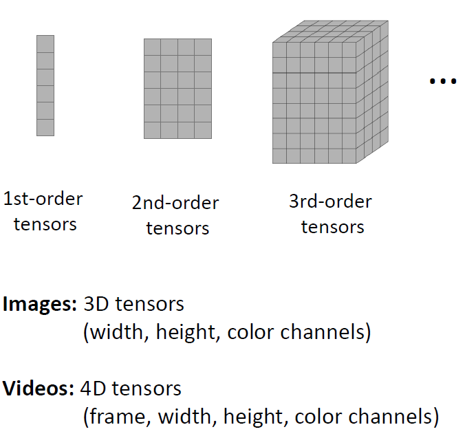
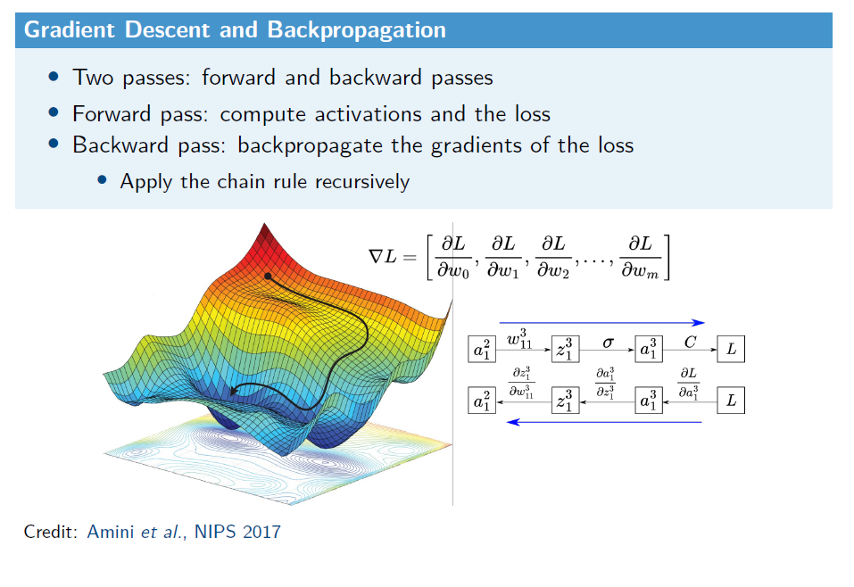
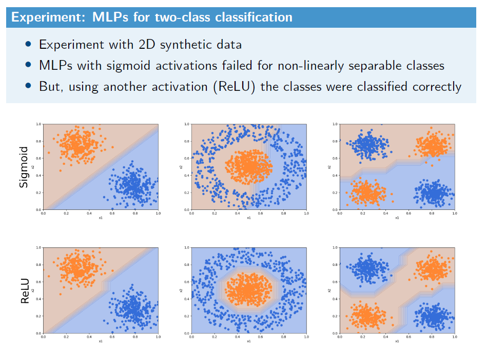
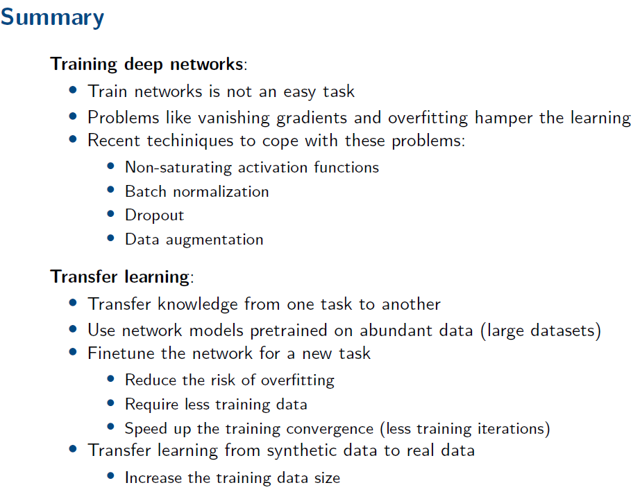

- **Lecture 10 - Tensor Factorization**
	- also known as: multi-linear algebra
	- mathematical technique used in machine learning
	- it involves
		- decomposing a tensor (a multi-dimensional array) into a set of actors or components that can be multiplied together to approximate the original tensor
		- it is analogous to matrix factorization, but extends to high dimensions beyond just rows and columns
	- key concepts
		- Tensor
			- a generalization of matrices to high dimensions
			- for instance, a 3D tensor can be thought of as a cube of data, with each dimension representing a difference aspect of the data
		- Rank of a Tensor
			- similar to the rank of a matrix, it is a measure of the complexity or the amount of information in the tensor
			- a lower-rank approximation aims to capture the most significant features of the tensor with fewer components
		- Factorization Methods
			- various methods exist, including CP Decomposition, Tucker Decomposition, Tensor Train Decomposition
		- Application
			- tensor factorization is used in various applications, such as image processing where images or video frames can be viewed as tensors
	- the goal of tensor factorization is to reduce the dimensionality of the data, uncover hidden structures, facilitate data compression, or enable feature extraction for tasks like classification, clustering, or anomaly detection
	- {:height 400, :width 400}
- **Lecture 12 - Deep Learning 2**
	- What is Deep Learning?
		- a machine learning (ML) method based on artificial neural networks (ANNs)
		- similar to other machine learning methods: supervised, unsupervised, or semi-supervised
		- can address tasks such as classification, regression, density estimation, etc.
	- Artificial Neural Networks (ANNs)
		- network of artificial neurons organized into layers
		- dense connections between adjacent layers
		- the number of layers define the model's depth
			- shallow models (up to 3 layers)
			- deep models (many layers)
		- learn a function that maps inputs into outputs
		- they have been studies for decades (since the 1940s)
			- initially they were shallow models (one single layer)
			- multi-layer perceptron (around 3 layers) started around the 1980s
			- deep artificial neural networks (around 100 layers) started in 2010s, thanks to more data, computational power, better learning algorithms and tools
	- deep learning outperforms other ML algorithms in complex tasks
		- speech, image, text procession
	- perceptron
		- artificial neuron for binary classification (0 or 1)
		- linearly separable problems
	- multi-layer perceptron (MLP)
		- stack of neurons organized into layers
		- solve complex problems: non-linearly separable problems
		- two changes
			- 1 - activation function
				- Sigmoid activation instead of the step function
			- 2 - learning approach
				- minimize a loss function
				- gradient descend algorithm
				- backpropagation
				- {:height 400, :width 400}
		- MLPs fail to classify correctly non-linearly separable classes (ie last image)
		- ReLU classifies correctly
		- {:height 400, :width 400}
	- Convolutional neural networks (CNNs)
		- network architecture that is good to work with images
		- the exploit the spatial information of images
		- extract hierarchical feature representations
			- lower layers: such as edges (more simple)
			- deeper layers: such as object parts (more complex)
		- efficient approach to extract features hierarchically
		- convolutional and pooling layers are the core of CNNs
			- convolutional layer
				- the weights associated to the inputs are called convolutional kernel or filter
				- feature map --> for each neuron we have one feature map
				- you can stack feature maps
			- pooling layer
				- provide spatial invariance
- **Lecture 13 - Deep Learning 3**
	- *how to deal with vanishing gradients*
		- weight initialization (Xavier's initialization)
		- non-saturating activation functions
			- fast to compute
			- no "dead" neuron problem
			- no vanishing gradient problem
		- batch normalization
			- alleviate the vanishing / exploding gradients during network training
			- it works over mini-batches of samples
			- step 1: center and normalize the input
			- step 2: scale and shift the normalized input
		- gradient clipping
	- *how to deal with overfitting*
		- early stopping
			- watch the validation loss
			- stop the training as soon as the validation less reaches a minimum
		- reduce model complexity
			- reduce the number of parameters by removing some hidden layers
			- downside is it might decrease the model capacity (underfitting)
			- large, deep network are more powerful than small ones
		- data augmentation
			- increase the amount of training data helps to deal with overfitting
			- artificially enlarging the training data is cheaper and more feasible
		- L1 and L2 regularization
			- add a regularization term in the loss during training
			- constrain the parameters (weight)
			- penalize large weights that can cause overfitting
		- dropout
			- modify the network structure (instead of the loss function)
			- some neurons are temporarily dropped out during training
			- each neuron has a probability p of being dropped out
	- transfer learning
		- using a network model pretrained for a particular task with abundant data
		- train or finetune the network model for a new task
			- reduces overfitting
			- requires less training data
			- speeds up the training (less convergence time)
			- reuse features learned in the pretrained model
			- many pretrained models are available on the internet
				- AlexNet
				- ResNet
				- etc.
			- some layers can be used from the pretrained model, others not
			- reused layers are frozen --> meaning weight do not change during training
		- {:height 400, :width 400}
			-
			-