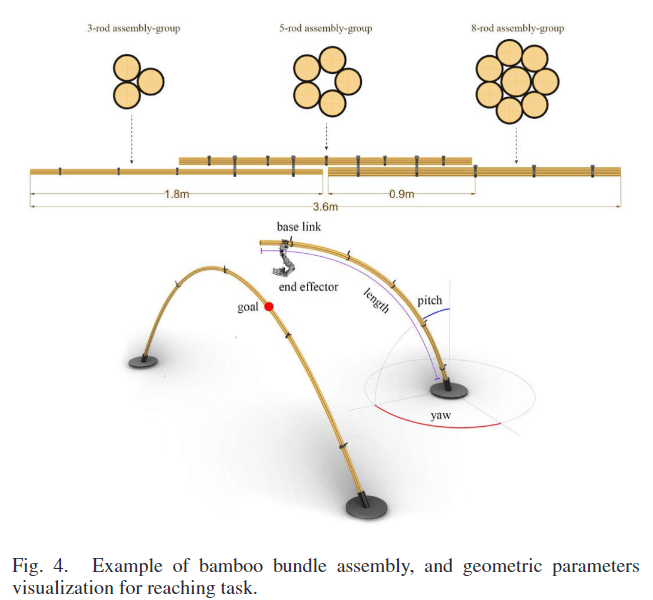

### Learning Robotic Manipulation of Natural Materials With Variable Properties for Construction Tasks
background-color:: green
authors:: [[Kalousdian, Lochnicki, Hartmann, Leder, Oguz, Menges, Toussaint]] 
type:: [[article]]
read-status:: [[read]]
published:: [[2022]]
link::  
additional-links::
major-themes:: #AI #robotics #hardware-softwareintegration #roboticsandautomation #manipulationtasks
minor-themes:: #bamboo #elasticdeformation #bendingactive
	- #### Content:
	-
	- #### Image:
	  {:height 300, :width 400}