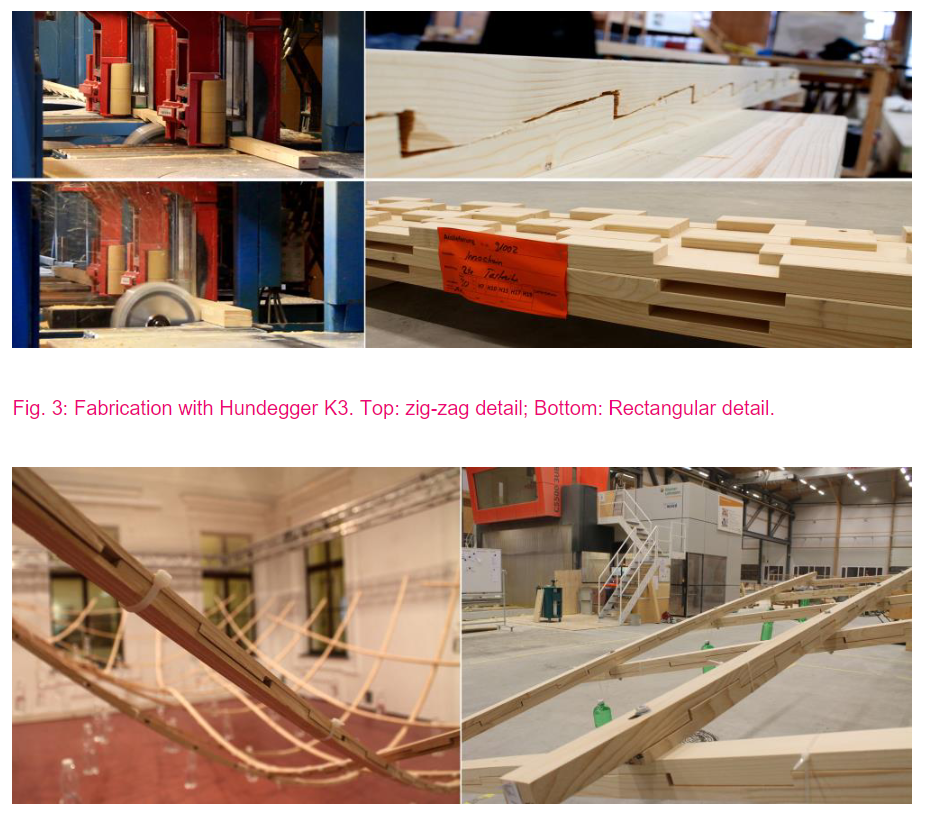
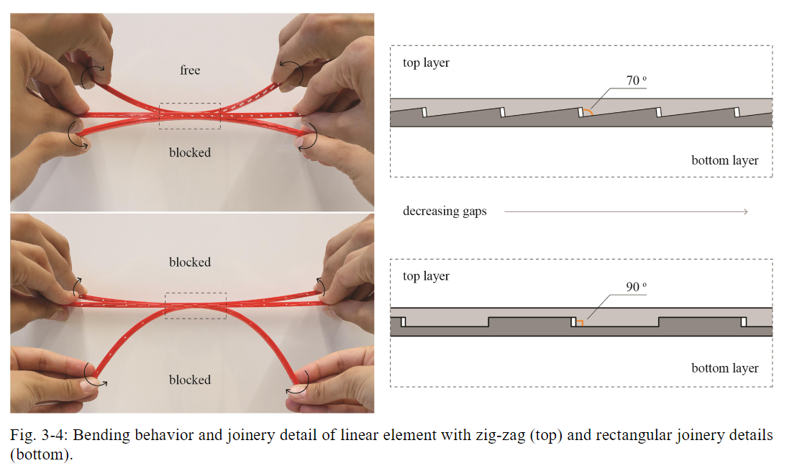
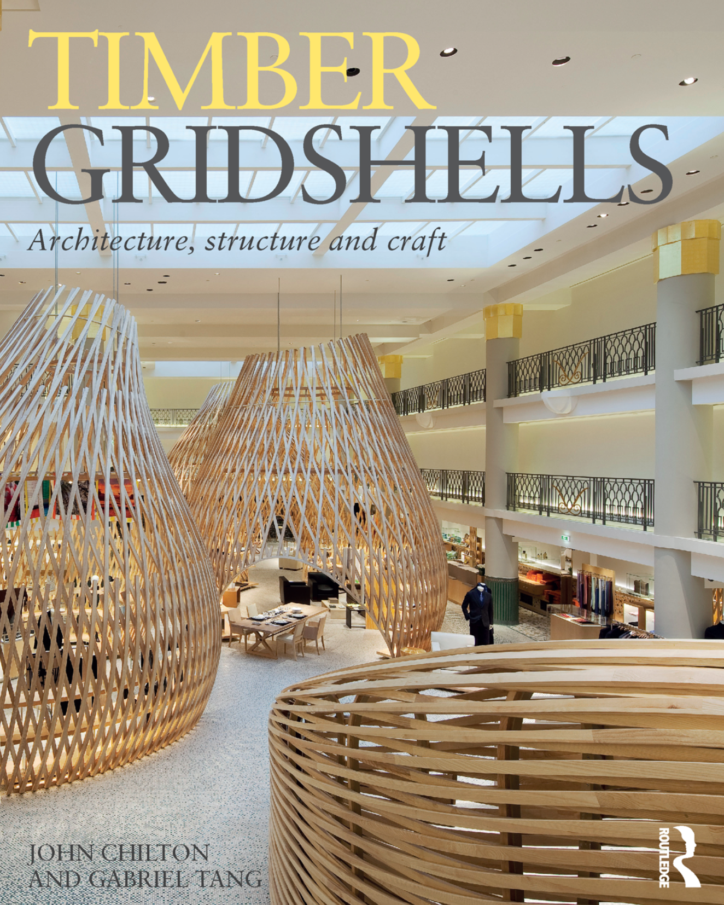

### Why That Nao? How Humans Adapt to a Conventional Humanoid Robot in Taking Turns at Talking
background-color:: green
authors:: [[Hannah R. M. Pelikan, Mathias Broth]] 
type:: [[article]]
read-status:: [[read]]
published:: [[2016]] 
link::  
additional-links::
major-themes:: #CROSS2024 
minor-themes:: #takingturns #taskhandoff #tasksequencing #conversationanalysis #intuitiveinteractions #HRI
	- #### Content:
		- participants play a game with a humanoid robot
		- adaptation of the humans as the robot’s limitations become obvious throughout the interaction
		- #takingturns / #taskhandoff is cumbersome, as there are long pauses and silences between the robot and human
		- the study focuses on how human naturally adapt and change their behaviour to make interactions with the robot work more smoothly
		- related work: current knowledge on human-machine interaction
			- human-human talk interaction
				- sequential organization
					- turns at talking are not simply following one after another, but they project back on what has been said before and create expectations about relevant next turns
					- asks the question throughout the interaction... *“why that now”*
				- recipient design
					- also known as audience design
					- humans naturally adjust their actions to reflect and be suited for the audience ie. his/ her knowledge, motives, expectations
					- together, two humans may constitute what is called a “partner model”
				- turn-taking
					- naturally, humans speak one at a time, minimizing gaps and overlaps
					- a form of negotiation
				- sequencing
					- groups of turns can be known as “adjacency pairs”, for example -- a greeting typically invokes a strong expectation for a follow-up greeting
				- repair
					- resolving trouble or problems such as hearing, understanding, speaking.. “what do you mean?...”
					- feedback or validation that the correct thing was understood or heard such as “you mean X?...”
			- human-machine interaction
				- *user must produce an adequate input that causes a state transition in order for the machine to proceed*
	- assumptions about natural dialogue
	- human expectations about the robot are shaped by the robot’s conduct early in the interaction
	- machines as social actors
	- some believe that humans treat computers as “fundamentally social” and “mindlessly transfer” human social rules and norms onto computers as though they were humans
	- differential human behaviour
	- humans are quick to adapt based on the feedback and interaction they are having with the robot
	- in conversation, this adaptability can be likened to conversation between native and non-native speaker
	- such as **phonology**: allowing longer silences, increased volume, more staccato speaking and annunciation, emphasis of important information by stressing it
	- such as **morpho-syntax**: shorter utterances, more questions
	- such as **semantics**: limited lexicon, more content words, more nouns/verbs
	- human-robot interaction
	- being autonomous, mobile, and having the ability to make decisions distinguish robots from other interactive systems
	- so far, studies have stressed the importance of **gaze** and **gesture** for easing human-robot interaction
	- Image:
	- Screenshot 2024-02-07 at 4.06.48 PM.png
	  
	  [2:07](https://crcl-enac-hq.slack.com/archives/D04N976EHK6/p1713528430221929)
	- Human-Machine Reconfigurations
	- Content:
	- * ****IMPORTANT CHAPTERS:***
	- Interactive Artefacts --> page 33
	- Human-Machine Communication --> page 125
	- Figuring the Human in AI and Robotics --> page 226
	- Cognitive science tells us: cognition is not just potentially *like* computation; it literally *is* computational
	- “Intelligence is the manipulation of symbols finding practical implementation both in so-called expert systems and industrial robots...
	- Expert systems
	- Essentially sophisticated programs that manipulate data structures to accord with rules of inference that experts are understood to use – have minimal sensory-motor or “peripheral” access to the world in which they are embedded, input being most commonly through a keyboard, by a human operator
	- Industrial robots
	- Highly specialized, computer-controlled devices designed to perform autonomously a single repetitive physical task – have relatively more developed sensory-motor apparatus than do expert systems, but the success of robotics is still confined to specialized activities, under controlled conditions
	- In both cases...
	- The systems can handle large amounts of encoded information, and syntactic relationships of great sophistication and complexity, in highly circumscribed domains. But when it comes either to direct interaction with the environment, or to the exercise of practical, everyday reasoning about the significance of events in the world, there is general agreement that the state of the art in intelligent machines has yet to attain the basic cognitive abilities of the normalfive-year-old child.”
	- “...controlling computing machines and the behavior that results [should be] increasingly linguistic rather than mechanistic.... machine operation becomes less a matter of pushing buttons or pulling levers and more a matter of specifying operations and assessing their effects through the use of a common language”
	- “interaction is always a tentative process, a process of continously testing the conception one has of... the other (Turner, 1962)”
	- a central premise of this book is:
	- projects in AI and robotics involve a kind of **doubling** or **mimicry** in the machine that works as a powerful disclosing agent for assumptions about the human
	- Rodney Brooks 1980s, Alison Adam 1998
	- As Adam points out, the question as framed by Brooks is whether cognition, and the knowledge that it presupposes, can be modeled separately from perception and motor control (1998: 137). Brooks’s answer is no, but the figure that results from his ensuing work, Adam observes, is “a bodied individual in a physical environment, rather than a socially situated individual”
	- #### Image:
	  [PASTE IMAGE HERE]{:height 300, :width 400}
-
- ### Digitally fabricated active-bending beams for the rapid assembly of temporary structures
  background-color:: green
  authors:: [[Efilena Baseta, Klaus Bollinger]]
  type:: [[article]]
  read-status:: [[read]]
  published:: [[2018]] 
  link::  
  additional-links::
  major-themes:: #bendingactive #elasticacurvature #elasticdeformation #woodjoints 
  minor-themes::
	- #### Content:
		- Construction is a labour intensive task, requiring higher efficiencies
			- Focusing on transportable, temporary structures, such as tents, an efficient construction method is active-bending
			- This method exploits the elastic bending of thin elements in order to create curved forms
		- The desired curvature, the smaller the cross-sectional height should be
			- This results to lower stiffness of the final structure due to the slenderness of its parts
			- In order to solve this problematic, research has been conducted on hybrid active bending structures
		- This research develops a multi-layer beam
			- flexible when flat -> can be deformed
			- stiff when bent -> can be deformed to a pre-defined curvature
			- relative slip between layers
			- stiffness results from constraining the slip through a zigzag profile in the beams
			- reversibility of the elements allows for applications in
				- temporary gridshell structures
	- #### Image:
	  {:height 300, :width 400}
-
- ### Bend and Block Dissertation
  background-color:: green
  authors:: [[Efilena Baseta]]
  type:: [[book]]
  read-status:: [[read]]
  published:: [[2019]] 
  link::  
  additional-links::
  major-themes::
  minor-themes::
	- #### Content:
		- design and the performance evaluation of a novel shape-adaptable system, called Bend & Block - a system allowing the instant and reversible stiffening of active-bending structures, through a bi-layer, self-actuating mechanism compliant, shape-adaptable structures rapidly-organized active bending structures
		- novel contributions
			- process for the design of a novel geometrical systems
			- data related to its structural performance
		- According to Goethe, form is seen as something fixated (form = Gestalt, formation = Bildung), while formation refers to a continuous unfolding (Menges & Alquist, 2011)
		- adaptive structures as a solution to rapidly changing circumstances including material resources, global temperatures --> passive actuation
		- “The wild wheat awn, the pine cone and the ice plant are some of the plants whose inherent movements and structures have been widely studied by scientists”
		- the stiffness of bending active systems can be divided into two stiffness components, which sum to total global stiffness
		- **the elastic stiffness Ke**
			- is constant as soon as the boundary conditions hold. Moreover, the elastic stiffness depends on the material properties, the cross section and the static system.
		- **the geometric stiffness Kg**
			- depends both on the static system and on the deflection of the element. In particular, the bigger the deformation the bigger the absolute value of the geometric stiffness.
		- Mannheim Multihalle -- technique used to attain stiffness
			- turning pin joints into fixed joints (tightening the pins) after erection
	- #### Image:
	  {:height 300, :width 400}
-
- ### Timber Gridshells
  background-color:: green
  authors:: [[Chilton, Tang]]
  type:: [[book]]
  read-status:: [[read]]
  published:: [[2017]] 
  link::  
  additional-links::
  major-themes::
  minor-themes::
	- #### Content:
	-
	- #### Image:
	  {:height 300, :width 400}
-
- ### Advancing Wood Architecture
  background-color:: green
  authors:: [[Achim Menges, Tobias Schwinn, Oliver David Krieg]]
  type:: [[book]]
  read-status:: [[read]]
  published:: [[2017]] 
  link::  
  additional-links::
  major-themes::
  minor-themes::
	- #### Content:
	-
	- #### Image:
	  {:height 300, :width 400}
-
- ### Past and Future of Gridshell Structures
  background-color:: green
  authors:: [[Celine Paoli]]
  type:: [[article]]
  read-status:: [[read]]
  published:: [[2007]] 
  link::  
  additional-links::
  major-themes::
  minor-themes::
	- #### Content:
	-
	- #### Image:
	  [PASTE IMAGE HERE]{:height 300, :width 400}
-
- ### Bending-active reciprocal structures based on equilateral polyhedral geometries
  background-color:: green
  authors:: [[Brancart, De Laet, Larsen, DeTemmerman]]
  type:: [[article]]
  read-status:: [[read]]
  published:: [[2017]] 
  link::  
  additional-links::
  major-themes::
  minor-themes::
	- #### Content:
	-
	- #### Image:
	  {:height 600, :width 600}
-
- ### Mapping material use and embodied carbon in UK construction
  background-color:: green
  authors:: [[Michał P. Drewniok, Jos´e Manuel Cruz Azevedo, Cyrille F. Dunant, Julian M. Allwood, Jonathan M. Cullen, Tim Ibell, Will  Hawkins]]
  type:: [[article]]
  read-status:: [[read]]
  published:: [[2023]] 
  link::  
  additional-links::
  major-themes:: #embodiedcarbon #materialuse #timberembodiedcarbon #materialflowanalysis
  minor-themes::
	- #### Content:
		- The construction and operation of buildings and infrastructure is responsible for 47% of global final energy-related CO2 emissions
		- About a third is related to the manufacturing building construction materials such as steel, cement and glass (IEA, 2022)
		- In 2019, the UK became the first major economy to commit to a net zero emissions target (The Climate Change Act, 2008)
		- The UK built environment accounts for 25% of the UK’s total greenhouse gas emissions, a quarter of which comes from new materials (Green et al., 2021). Decarbonising the built environment will require improvements in material production, energy efficiency, heating and waste production (IEA, 2022). However, these improvements will not be sufficient to meet global and UK emissions targets if resource efficiency is not concurrently improved (Allwood et al., 2019)
		- A detailed analysis of the current use of materials (and their emissions) in construction is needed to identify the most effective areas for implementing material efficiency strategies. Apart from global, regional and national material statistics, there is no detailed information on the use of materials in construction.
		- Conclusion:
			- Switching to the most material and carbon efficient technology options for building components. Our analysis shows that even using readily available technologies in buildings (e.g. timber frames or single-leaf external walls with clay blocks) can save 4.5 MtCO2e each year, or almost 20% of the construction total.
	- #### Image:
	  {:height 600, :width 600}
-
- ### RUBI LAB: Active Bending in Physics-Based Mixed Reality
  background-color:: green
  authors:: [[Alexander Htet Kyaw, Jack Michael Otto]]
  type:: [[website]]
  read-status:: [[read]]
  published:: [[2023]] 
  link:: https://labs.aap.cornell.edu/node/897  
  additional-links::
  major-themes::
  minor-themes::
	- #### Content:
		- Active Bending in Physics-Based Mixed Reality addresses the difficulties of designing with a **non-standard** and **structurally dynamic material**, such as bamboo
		- Mixed reality (MR) as a virtual and collaborative design environment with integrated material physics simulations. This research describes the development of a workflow that integrates a reconfigurable modular bamboo system leveraging the active 
		  bending property of bamboo, a custom physics-based MR environment facilitating on-site collaborative design, and an MR user interface enabling users to customize material parameters unique to bamboo.
		- The reconfigurable modular bamboo system is a kit of parts consisting of linear, triangular, and tetrahedral bundled bamboo modules that can be assembled on the ground and lofted into complex active bending structures. Through a Physics-Based Mixed Reality design framework, multiple users can reconfigure these modules virtually, dynamically, and collaboratively, iterating through several configurations on-site before deploying real-world resources.
		- The result is a custom MR environment that enables non-expert users to participate in the design process through a user interface for managing module properties and connectivity.
	- #### Image:
	  {:height 700, :width 700}
-
- ### Co-Designing Material-Robot Construction Behaviours
  background-color:: green
  authors:: [[Kalousdian, Lochnicki, Leder, Maierhofer, Wood, Menges]]
  type:: [[article]]
  read-status:: [[read]]
  published:: [[2021]] 
  link::  
  additional-links::
  major-themes::
  minor-themes::
	- #### Content:
	-
	- #### Image:
	   {:height 300, :width 400}
-
- ### The Sawmill Process
  background-color:: green
  authors:: [[Swedish Forum for Wood Technology]]
  type:: [[article]]
  read-status:: [[read]]
  published:: [[2023]] 
  link::  
  additional-links::
  major-themes:: #timberprocessing #timberrawresource #sawmillproduction #productionflow 
  minor-themes:: #sustainability #sawingpatterns
	- #### Content:
	-
	- #### Image:
	  {:height 800, :width 800}
-
- ### Swedish forest industries: the cycle of forestry
  background-color:: green
  authors:: [[Swedish forest industries federation]]
  type:: [[website]]
  read-status:: [[read]]
  published:: [[2021]] 
  link:: https://www.forestindustries.se/forest-industry/forest-management/forestry/the-cycle-of-forestry/ 
  additional-links::
  major-themes:: #forestrypractices #sustainableforestmanagement #timberrawresource 
  minor-themes:: #swedenforestry #scandinavianforestry
	- #### Content:
		- taking a long term perspective on forests:
			- inventories in an area and mapping out which conservation values, for example how many old trees, deadwood, or broadleaf trees there are
			- example: thinning out spruce to allow more space for broadleaf trees or carrying out a nature conservation burning (a planned forest fire in a defined area) to create more opportunities for plants and animals
	- #### Image:
	  {:height 300, :width 400}