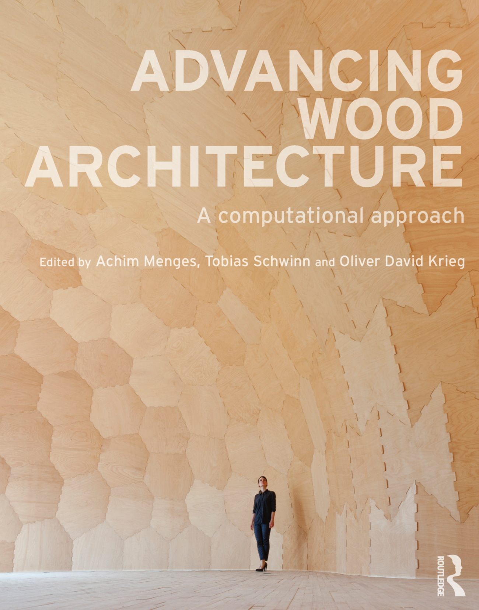
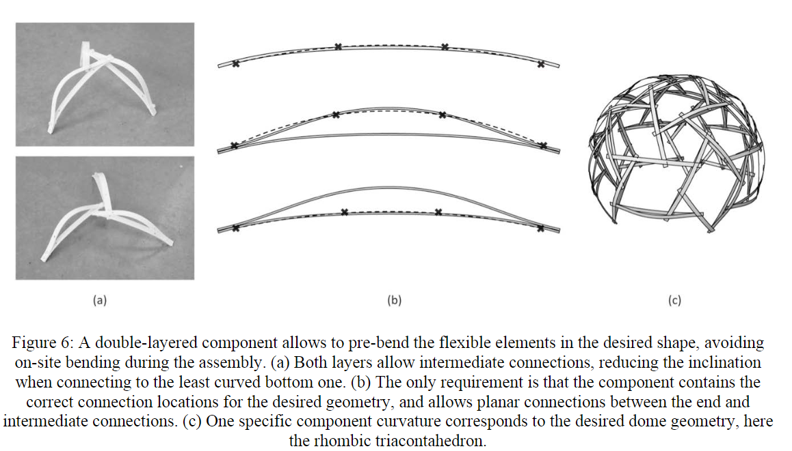
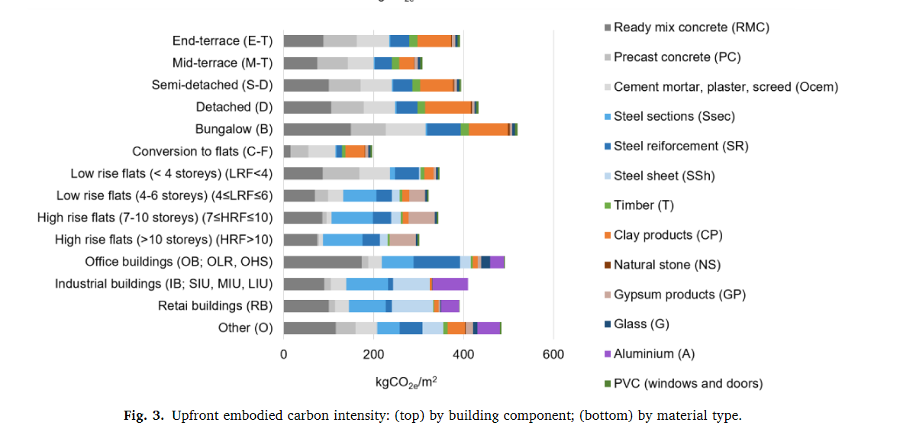
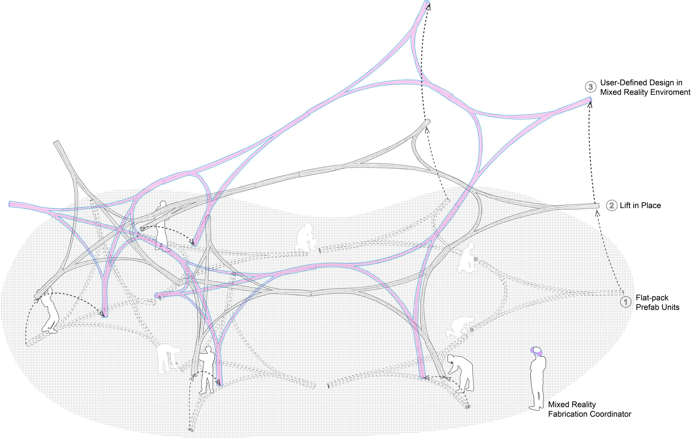
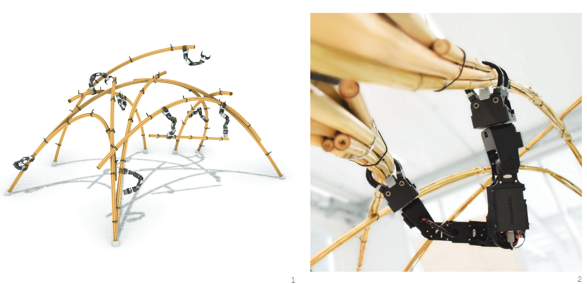
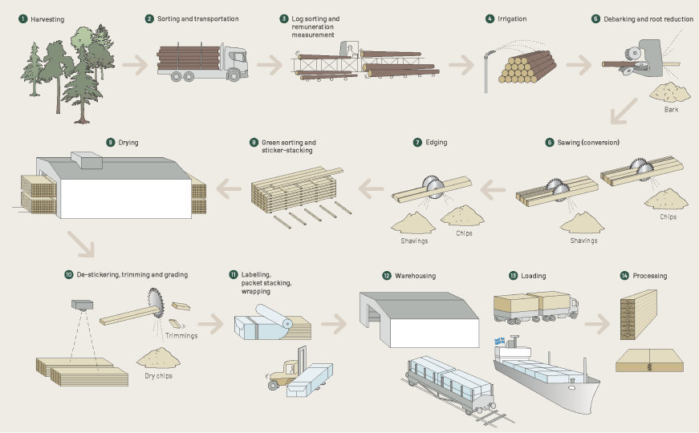

### Timber Gridshells
background-color:: green
authors:: [[]]
type:: [[book]]
read-status:: [[read]]
published:: [[]] 
link::  
additional-links::
major-themes::
minor-themes::
	- #### Content:
	-
	- #### Image:
	  [PASTE IMAGE HERE]{:height 300, :width 400}
-
- ### Advancing Wood Architecture
  background-color:: green
  authors:: [[Achim Menges, Tobias Schwinn, Oliver David Krieg]]
  type:: [[book]]
  read-status:: [[read]]
  published:: [[2017]] 
  link::  
  additional-links::
  major-themes::
  minor-themes::
	- #### Content:
	-
	- #### Image:
	  {:height 300, :width 400}
-
- ### Past and Future of Gridshell Structures
  background-color:: green
  authors:: [[Celine Paoli]]
  type:: [[article]]
  read-status:: [[read]]
  published:: [[2007]] 
  link::  
  additional-links::
  major-themes::
  minor-themes::
	- #### Content:
	-
	- #### Image:
	  [PASTE IMAGE HERE]{:height 300, :width 400}
-
- ### Bending-active reciprocal structures based on equilateral polyhedral geometries
  background-color:: green
  authors:: [[Brancart, De Laet, Larsen, DeTemmerman]]
  type:: [[article]]
  read-status:: [[read]]
  published:: [[2017]] 
  link::  
  additional-links::
  major-themes::
  minor-themes::
	- #### Content:
	-
	- #### Image:
	  {:height 600, :width 600}
-
- ### Mapping material use and embodied carbon in UK construction
  background-color:: green
  authors:: [[Michał P. Drewniok, Jos´e Manuel Cruz Azevedo, Cyrille F. Dunant, Julian M. Allwood, Jonathan M. Cullen, Tim Ibell, Will  Hawkins]]
  type:: [[article]]
  read-status:: [[read]]
  published:: [[2023]] 
  link::  
  additional-links::
  major-themes:: #embodiedcarbon #materialuse #timberembodiedcarbon #materialflowanalysis
  minor-themes::
	- #### Content:
		- The construction and operation of buildings and infrastructure is responsible for 47% of global final energy-related CO2 emissions
		- About a third is related to the manufacturing building construction materials such as steel, cement and glass (IEA, 2022)
		- In 2019, the UK became the first major economy to commit to a net zero emissions target (The Climate Change Act, 2008)
		- The UK built environment accounts for 25% of the UK’s total greenhouse gas emissions, a quarter of which comes from new materials (Green et al., 2021). Decarbonising the built environment will require improvements in material production, energy efficiency, heating and waste production (IEA, 2022). However, these improvements will not be sufficient to meet global and UK emissions targets if resource efficiency is not concurrently improved (Allwood et al., 2019)
		- A detailed analysis of the current use of materials (and their emissions) in construction is needed to identify the most effective areas for implementing material efficiency strategies. Apart from global, regional and national material statistics, there is no detailed information on the use of materials in construction.
		- Conclusion:
			- Switching to the most material and carbon efficient technology options for building components. Our analysis shows that even using readily available technologies in buildings (e.g. timber frames or single-leaf external walls with clay blocks) can save 4.5 MtCO2e each year, or almost 20% of the construction total.
	- #### Image:
	  {:height 600, :width 600}
-
- ### RUBI LAB: Active Bending in Physics-Based Mixed Reality
  background-color:: green
  authors:: [[Alexander Htet Kyaw, Jack Michael Otto]]
  type:: [[website]]
  read-status:: [[read]]
  published:: [[2023]] 
  link:: https://labs.aap.cornell.edu/node/897  
  additional-links::
  major-themes::
  minor-themes::
	- #### Content:
		- Active Bending in Physics-Based Mixed Reality addresses the difficulties of designing with a **non-standard** and **structurally dynamic material**, such as bamboo
		- Mixed reality (MR) as a virtual and collaborative design environment with integrated material physics simulations. This research describes the development of a workflow that integrates a reconfigurable modular bamboo system leveraging the active 
		  bending property of bamboo, a custom physics-based MR environment facilitating on-site collaborative design, and an MR user interface enabling users to customize material parameters unique to bamboo.
		- The reconfigurable modular bamboo system is a kit of parts consisting of linear, triangular, and tetrahedral bundled bamboo modules that can be assembled on the ground and lofted into complex active bending structures. Through a Physics-Based Mixed Reality design framework, multiple users can reconfigure these modules virtually, dynamically, and collaboratively, iterating through several configurations on-site before deploying real-world resources.
		- The result is a custom MR environment that enables non-expert users to participate in the design process through a user interface for managing module properties and connectivity.
	- #### Image:
	  {:height 700, :width 700}
-
- ### Co-Designing Material-Robot Construction Behaviours
  background-color:: green
  authors:: [[Kalousdian, Lochnicki, Leder, Maierhofer, Wood, Menges]]
  type:: [[article]]
  read-status:: [[read]]
  published:: [[2021]] 
  link::  
  additional-links::
  major-themes::
  minor-themes::
	- #### Content:
	-
	- #### Image:
	   {:height 300, :width 400}
-
- ### The Sawmill Process
  background-color:: green
  authors:: [[Swedish Forum for Wood Technology]]
  type:: [[article]]
  read-status:: [[read]]
  published:: [[2023]] 
  link::  
  additional-links::
  major-themes:: #timberprocessing #timberrawresource #sawmillproduction #productionflow 
  minor-themes:: #sustainability #sawingpatterns
	- #### Content:
	-
	- #### Image:
	  {:height 800, :width 800}
-
- ### Swedish forest industries: the cycle of forestry
  background-color:: green
  authors:: [[Swedish forest industries federation]]
  type:: [[website]]
  read-status:: [[read]]
  published:: [[2021]] 
  link:: https://www.forestindustries.se/forest-industry/forest-management/forestry/the-cycle-of-forestry/ 
  additional-links::
  major-themes:: #forestrypractices #sustainableforestmanagement #timberrawresource 
  minor-themes:: #swedenforestry #scandinavianforestry
	- #### Content:
		- taking a long term perspective on forests:
			- inventories in an area and mapping out which conservation values, for example how many old trees, deadwood, or broadleaf trees there are
			- example: thinning out spruce to allow more space for broadleaf trees or carrying out a nature conservation burning (a planned forest fire in a defined area) to create more opportunities for plants and animals
	- #### Image:
	  {:height 300, :width 400}